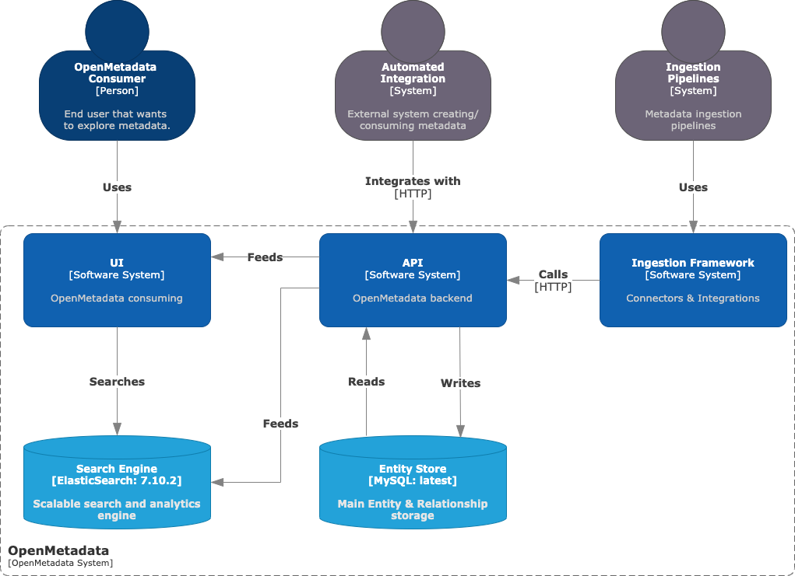

  <h1 align="center">OpenMetadata metadata management platform</h1>
  

    <a href="README_ZH.md"><strong>简体中文</strong></a> | <strong>English</strong>
  

## Table of Contents

- [Repository Introduction](#repository-introduction)  
- [Prerequisites](#prerequisites)  
- [Image Specifications](#image-specifications)
- [Getting Help](#getting-help)
- [How to Contribute](#how-to-contribute)

## Repository Introduction  
[OpenMetadata](https://github.com/open-metadata/OpenMetadata) is a unified metadata platform used for data discovery, observability, and governance, supported by a central metadata repository and deep column level lineage. Open Metadata is based on open metadata standards and APIs, supporting connectors for various data services and enabling end-to-end metadata management.

**Core Features:**
1. Data Collaboration - Obtain event notifications through activity sources. Use webhooks to send alerts and notifications. Add an announcement to notify the team of upcoming changes. Add tasks to request description or terminology approval workflow. Add user mentions and collaborate using conversation threads.
2. Data Quality and Analyzer - Standardized Testing and Data Quality Metadata. Group relevant tests into test suites. Support custom SQL data quality testing. There is an interactive dashboard that allows for in-depth understanding of detailed information.
3. Data lineage - supports rich column level lineage. Effectively filter queries to extract lineage. Manually edit the lineage as needed and connect entities using a codeless editor.
4. Comprehensive roles and strategies - handling complex access control use cases and hierarchical teams.
5. Connectors - Supports 55 connectors that connect to various databases, dashboards, pipelines, and messaging services. Glossary - adds controlled vocabulary to describe important concepts and terms within the organization. Add vocabulary, terminology, tags, descriptions, and reviewers.

**Architecture Design:**

This project offers pre-configured [**OpenMetadata metadata management platform**](https://marketplace.huaweicloud.com/intl/hidden/contents/93c2863a-2fd6-4134-ae62-43e523fe1ffb) images with OpenMetadata and its runtime environment pre-installed, along with deployment templates. Follow the guide to enjoy an "out-of-the-box" experience.

> **System Requirements:**
> - CPU: 2GHz or higher  
> - RAM: 4GB or more  
> - Disk: At least 40GB  

## Prerequisites  
[Register a Huawei account and activate Huawei Cloud](https://support.huaweicloud.com/usermanual-account/account_id_001.html)

## Image Specifications  

| Image Version                                                                                                      | Description                                              | Notes |  
|--------------------------------------------------------------------------------------------------------------------|----------------------------------------------------------|-------|  
| [OpenMetadata1.7-kunpeng-v1.0](https://github.com/HuaweiCloudDeveloper/OpenMetadata-image/tree/OpenMetadata1.7-kunpeng-v1.0) | Deployed on Kunpeng servers with Huawei Cloud EulerOS 2.0 64bit |  | 
| [OpenMetadata1.7-kunpeng-v1.0](https://github.com/HuaweiCloudDeveloper/OpenMetadata-image/tree/OpenMetadata1.7-kunpeng-v1.0) | Deployed on Kunpeng servers with Ubuntu24.04 64bit   |  |  

## Getting Help
- Submit an [issue](https://github.com/HuaweiCloudDeveloper/OpenMetadata-image/issues)
- Contact Huawei Cloud Marketplace product support

## How to Contribute
- Fork this repository and submit a merge request.
- Update README.md synchronously based on your open-source mirror information.
