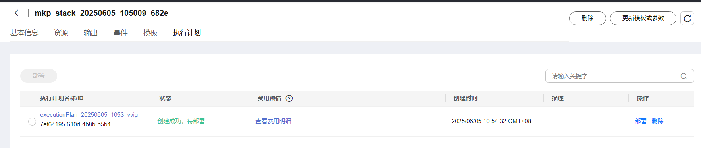
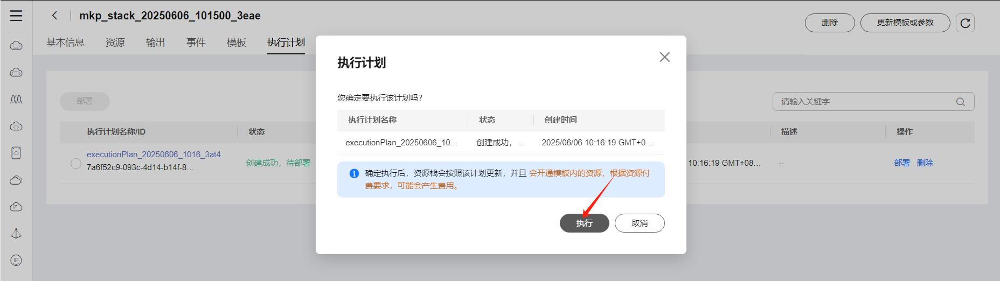
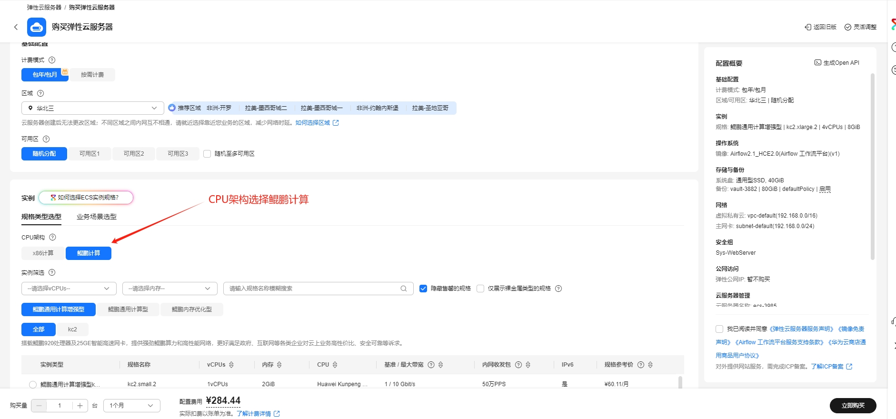
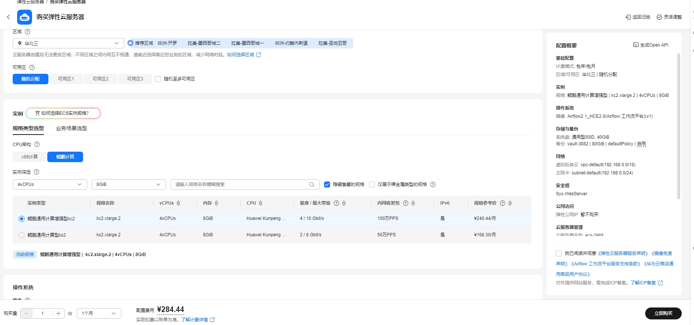
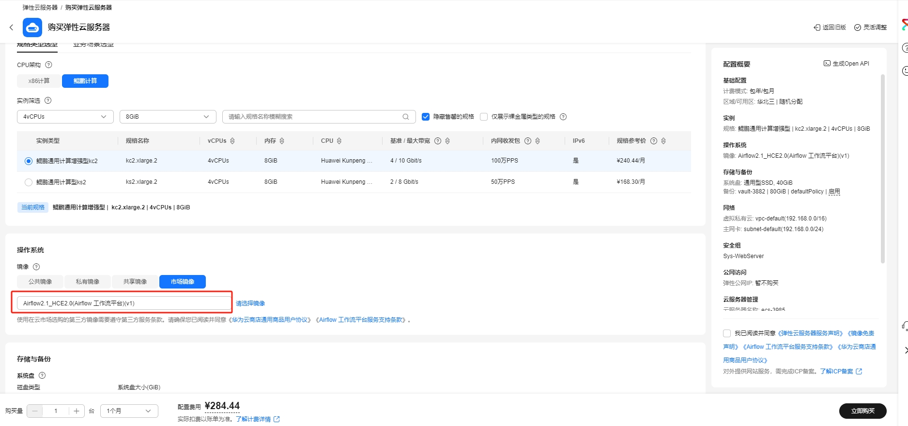
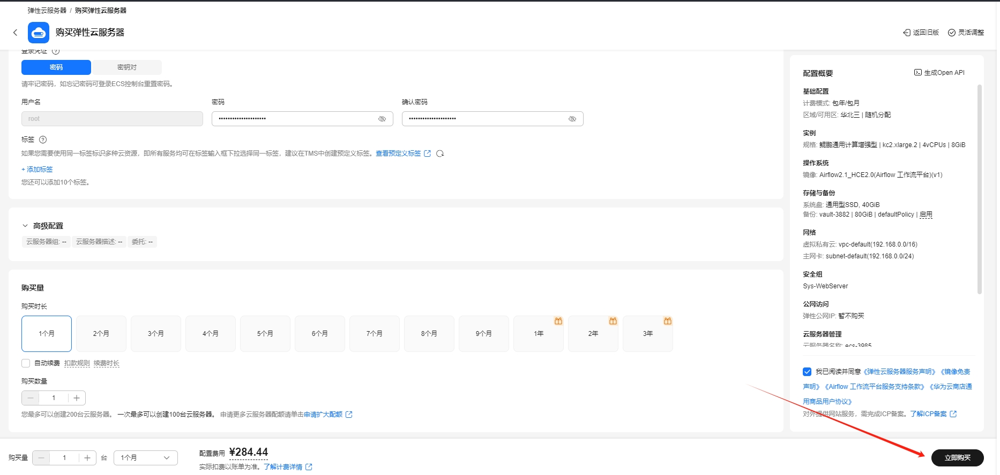

# OpenMetadata元数据平台使用指南

# 一、商品链接

[OpenMetadata元数据平台](https://marketplace.huaweicloud.com/hidden/contents/f5371015-bb64-4f24-ae68-c8718967e232#productid=OFFI1144191798531158016)

# 二、商品说明

**OpenMetadata** 是一个统一的元数据平台，用于数据发现，数据可观察性和数据治理，由中央元数据存储库，深入的列级血统来提供支撑。Open Metadata基于开放元数据标准和API，支持各种数据服务的连接器，可实现端到端元数据管理，让您自由释放数据资产的价值。

# 三、商品购买

您可以在云商店搜索 **OpenMetadata元数据平台**。

其中，地域、规格、推荐配置使用默认，购买方式根据您的需求选择按需/按月/按年，短期使用推荐按需，长期使用推荐按月/按年，确认配置后点击“立即购买”。

## 3.1 使用 RFS 模板直接部署

必填项填写后，点击 下一步

创建直接计划后，点击 确定

点击部署，执行计划

如下图“Apply required resource success. ”即为资源创建完成

##  3.2 ECS 控制台配置

### 准备工作

在使用ECS控制台配置前，需要您提前配置好 **安全组规则**。

> **安全组规则的配置如下：**
> - 入方向规则放通端口8585，源地址内必须包含您的客户端ip，否则无法访问 
> - 入方向规则放通 CloudShell 连接实例使用的端口 `22`，以便在控制台登录调试
> - 出方向规则一键放通

### 创建ECS

前提工作准备好后，选择 ECS 控制台配置跳转到[购买ECS](https://support.huaweicloud.com/qs-ecs/ecs_01_0103.html) 页面，ECS 资源的配置如下图所示：

选择CPU架构

选择服务器规格

选择镜像

其他参数根据实际请客进行填写，填写完成之后，点击立即购买即可

> **值得注意的是：**
> - VPC 您可以自行创建
> - 安全组选择 [**准备工作**](#准备工作) 中配置的安全组；
> - 弹性公网IP选择现在购买，推荐选择“按流量计费”，带宽大小可设置为5Mbit/s；
> - 高级配置需要在高级选项支持注入自定义数据，所以登录凭证不能选择“密码”，选择创建后设置；
> - 其余默认或按规则填写即可。

# 四、商品使用

## 进入 docker compose 启动目录
cd /root/openmetadata-docker  

## 启动 docker 容器服务
ubuntu 系统中 docker 启动命令：  
docker-compose up -d  

欧拉系统中 docker 启动命令：  
docker compose up -d

## 访问 open-metadata 管理页面
地址： http://x.x.x.x:8585  
用户： admin@open-metadata.org  
密码： admin  

## 其他 airflow 页面(open-metadata 依赖 airflow 同步元数据)
地址： http://x.x.x.x:8080  
用户： admin  
密码： admin  

#### 注意事项
airflow 服务和配置元数据同步服务相对慢一点，需要等待时间。  
本镜像当中 airflow 和 open-metadat 已经做了集成，不需要再额外安装 airflow。  

## 参考文档

[OpenMetadata官网](https://open-metadata.org/)
